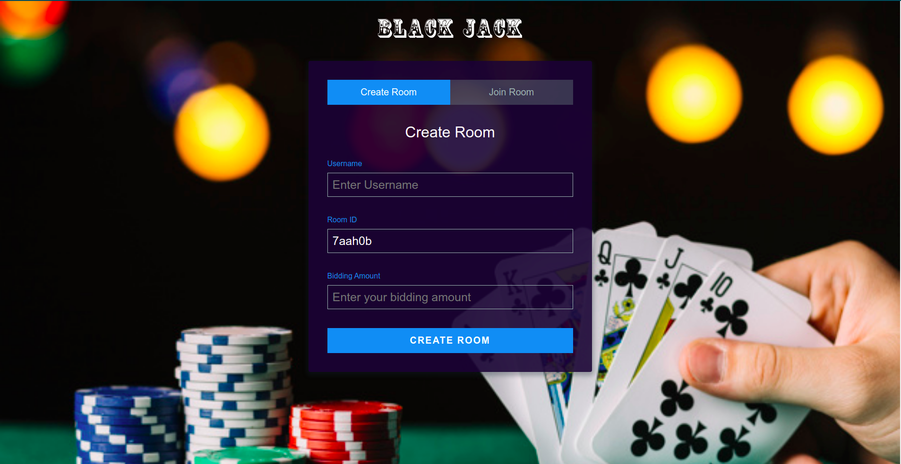
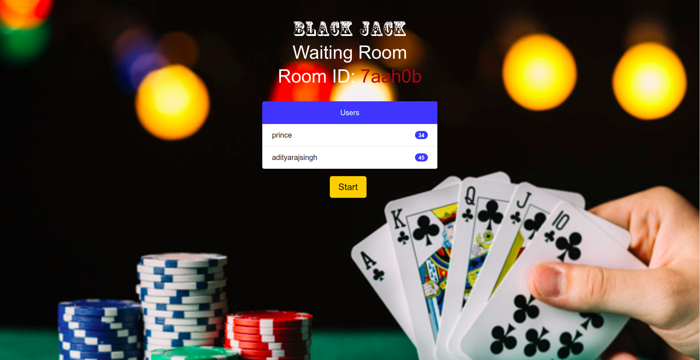

# BLACK JACK

A multiplayer online blackjack game.

## Play
Want to try it out?  [Play].(https://black--jack.herokuapp.com/) 
## Description
  A multiplayer blackjack game made using Node JS and Socket.io in which you can play with others sharing your own private room password. 
Also authenticate yourself to play and keep track of your overall profit/loss!

## Demo
A complete demo of the game can be found [here].(https://www.youtube.com/watch?v=vaTA9Ve-tVw) 

## How to set it up?
- Clone this repository.
- Then inside the folder.

Using npm:

```bash
$ npm install
```

## How to start? 
Using npm:

```bash
$ npm start
```
# Screenshots





## Technology Stack
- HTML, CSS
- Javascript
- jQuery
- Node.js 
- Socket.io 

## References
- Stack Overflow
- Socket.io

## Future Updates
- Leaderboard
- Authorization using Social Platforms
- Multiple Rooms
